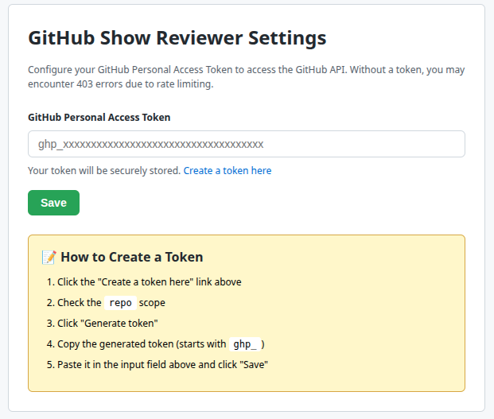

# GitHub Show Reviewer

A Chrome extension that displays reviewers directly in the GitHub Pull Request list view.

<pre class="vditor-reset" placeholder="" contenteditable="true" spellcheck="false">

</pre>

## Features

- Shows reviewers on the PR list page without opening individual PRs
- Displays both individual reviewers and team reviewers
- Supports both requested reviewers and users who have already reviewed
- Click on reviewer names to filter PRs by reviewer

## Installation for Developers

1. Clone this repository
2. Open Chrome and navigate to `chrome://extensions`
3. Enable "Developer mode" in the top right corner
4. Click "Load unpacked" and select the extension directory

## Configuration

For private repositories or to increase API rate limits, you need to configure your GitHub Personal Access Token.

1. Open Chrome and navigate to `chrome://extensions`
2. Find "GitHub Show Reviewer" and click "Details"
3. Click "Extension options"
4. The GitHub Show Reviewer Settings page will open as shown below

5. Click "Create a token here" link
6. GitHub's "New personal access token (classic)" page will open
7. Check the `repo` scope (required for private repositories)
8. Generate the token and copy it
9. Return to the GitHub Show Reviewer Settings page
10. Paste the token in the input field and click "Save"
